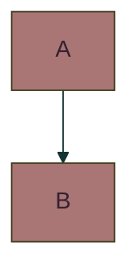

# Styled Diagrams as Code

## Mermaid

Github formally supports Mermaid syntax in Readme files. https://github.blog/developer-skills/github/include-diagrams-markdown-files-mermaid/

Generating the styles for these can be a pain. So I created this project.

## Interactivity

I added click handlers to the Mermaid diagram's nodes so additional notes/connections can be added easily. 

## Todo

- [ ] Persist mermaid code as a node graph in a user data store, rather than as flat text. This will let me add additional metadata and workflows across sessions, i.e. using user-unique Node IDs in a DB.  
- [ ] Top-down vs left-right toggle  
- [ ] Curved lines vs straight lines.  
- [ ] Using URL params for the initial chart render allows sharing themed diagrams as links.  
